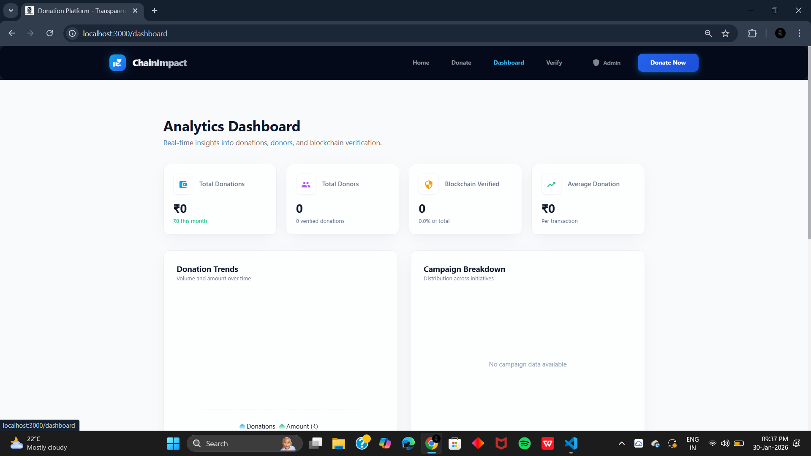
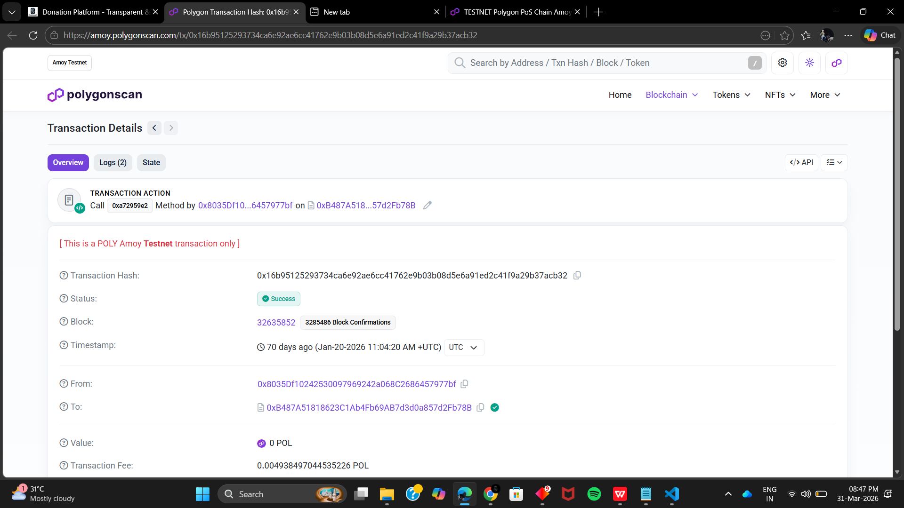

# Donation Transparency & Verification Platform

> **AI-assisted donation processing with blockchain-backed transparency and verifiable transaction records.**

A full-stack platform that combines **AI/OCR, secure donation management, and blockchain technology** to improve the accuracy, transparency, and verifiability of donation records.

---

## ✨ Features

* **AI/OCR-assisted extraction** — Extract transaction details from supported payment screenshots.
* **Donation management** — Store, manage, search, and track donation records.
* **Blockchain verification** — Record and verify donation transactions on Polygon Amoy.
* **Wallet integration** — Connect and interact with the blockchain through a Web3-compatible wallet.
* **Dashboard & analytics** — View donation activity, statistics, and insights.
* **Digital records** — Maintain structured donation information and generate receipts where supported.

---

## 🔄 Workflow

```text
Payment Evidence
       ↓
   AI / OCR
       ↓
   Validation
       ↓
Donation Record
       ↓
Blockchain Transaction
       ↓
 Polygon Amoy
       ↓
Transaction Verification
```

---

## 🛠️ Tech Stack

| Layer           | Technology              |
| --------------- | ----------------------- |
| Frontend        | React.js, Material UI   |
| Backend         | Python, Flask           |
| Database        | Supabase                |
| Blockchain      | Solidity, Web3.py       |
| Network         | Polygon Amoy Testnet    |
| Smart Contracts | Hardhat                 |
| AI / OCR        | EasyOCR, OpenCV, Pillow |
| Charts          | Recharts                |
| HTTP            | Axios                   |
| PDF             | ReportLab               |

---

## 🏗️ Architecture

```text
┌──────────────────────┐
│    React Frontend    │
│                      │
│ Donation • Dashboard │
│ Verification • Wallet│
└──────────┬───────────┘
           │
           │ API
           ▼
┌──────────────────────┐
│    Flask Backend     │
│                      │
│ Validation • OCR     │
│ Donation • Web3      │
└───────┬────────┬─────┘
        │        │
        ▼        ▼
   ┌────────┐  ┌──────────────┐
   │Supabase│  │ Polygon Amoy │
   └────────┘  └──────────────┘
```

---

## 📁 Project Structure

```text
gen_ai/
├── frontend/                       # React application
├── contracts/                      # Solidity smart contracts
├── docs/
│   ├── screenshots/                # Project screenshots
│   └── demo/                       # Project demonstration video
├── app.py                          # Flask application
├── config.py                       # Application configuration
├── blockchain_service.py            # Blockchain integration
├── supabase_blockchain_manager.py   # Supabase / blockchain management
├── requirements.txt                # Python dependencies
├── hardhat.config.js               # Hardhat configuration
├── .env.example                    # Environment template
├── .gitignore
└── README.md
```

---

## 📸 Screenshots

### Dashboard


### Blockchain Verification

  ---

## 🎥 Project Demo

[▶️ Watch the Project Demo](docs/demo/chain impact recordings.mp4)

---

## ⛓️ Blockchain

The project uses **Polygon Amoy Testnet** for blockchain development and verification.

| Property     | Value                                             |
| ------------ | ------------------------------------------------- |
| Network      | Polygon Amoy Testnet                              |
| Chain ID     | `80002`                                           |
| Native Token | `POL`                                             |
| Explorer     | [PolygonScan Amoy](https://amoy.polygonscan.com/) |

### RPC Configuration

Configure the RPC through the environment variable:

```env
ETHEREUM_NETWORK=amoy
AMOY_RPC_URL=<supported-amoy-rpc-url>
AMOY_CHAIN_ID=80002
```

> Public testnet RPC endpoints may change or become unavailable. If the configured endpoint stops working, replace `AMOY_RPC_URL` with a currently supported Polygon Amoy RPC provider. The Chain ID remains `80002`.

**This project uses Polygon Amoy Testnet, not Polygon Mainnet.**

---

## 🦊 Wallet Configuration

For blockchain testing, connect MetaMask to:

```text
Network: Polygon Amoy
Chain ID: 80002
Currency: POL
```

The wallet network must match the application's configured blockchain network.

---

## ⚙️ Getting Started

### Prerequisites

* Python
* Node.js & npm
* MetaMask for blockchain testing

### Backend

```powershell
python -m venv venv
.\venv\Scripts\activate
pip install -r requirements.txt
python app.py
```

### Frontend

```powershell
cd frontend
npm install
npm start
```

Default development URLs:

```text
Frontend: http://localhost:3000
Backend:  http://localhost:5000
```

---

## 🔐 Environment Variables

Create a local `.env` file using `.env.example` as a reference.

Sensitive values must never be committed to the repository.

```env
ETHEREUM_NETWORK=amoy
AMOY_RPC_URL=<your-amoy-rpc-url>
AMOY_CHAIN_ID=80002
```

Other required environment variables should be configured according to the project's existing `.env.example` and application configuration.

---

## 📜 Smart Contract

Smart contract source code is located in:

```text
contracts/
```

The project uses **Solidity** and **Hardhat** for smart contract development and deployment.

Deployment metadata, including the configured contract address where applicable, is maintained within the project's existing contract configuration.

---

## 👥 Project Members

* **Sams Winson A**
* **Akash G**

---

## 🔒 Security

* Keep secrets in environment variables.
* Never commit `.env` files containing credentials.
* Never commit wallet private keys.
* Validate application input before processing.
* Treat blockchain records as verifiable transaction records, not as proof that every off-chain claim is truthful.

---

## 🤝 Contributing

Contributions are welcome.

1. Fork the repository.
2. Create a focused branch.
3. Make and test your changes.
4. Open a Pull Request.

Please keep contributions focused and avoid unrelated architectural changes.

---

**Donation Transparency & Verification Platform**

AI-assisted processing • Blockchain-backed records • Verifiable transactions

**Sams Winson A · Akash G**
